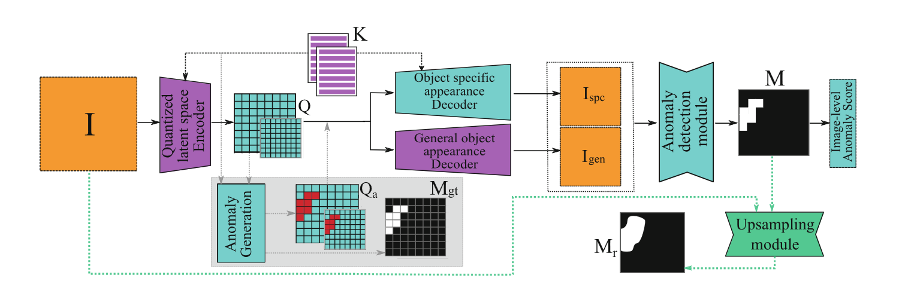

# Model Evaluation

### Anomalib DSR (Deep Spatial Representation) Model
*(Unsupervised Model Training)*
Quantized-feature based algorithm that consists of an autoencoder with one encoder and two decoders, coupled with an anomaly detection module. DSR learns a codebook of quantized representations on ImageNet, which are then used to encode input images


 1) Encode Input Images Into Quantized Feature Maps
 2) Reconstruct Images Using A General Appearance Decoder
 3) Detect Anomalies By Comparing Reconstructed & Original Images


### Dataset
**MIIC (Microscopic Images of Integrated Circuits)**
Contains a large-scale dataset real microscopic images of integrated circuits (ICs) obtained by Scanning Electron Microscopy (SEM). The SEM images are taken at the metal layer of a manufactured IC and are in gray-scale with a dimension of 512x512 pixels. For each image containing anomalies, a bounding box and pixel-wise ground truth mask is provided.

[github link](https://github.com/wenbihan/MIIC-IAD)


### Training Configuration

- **Training Type:** Unsupervised (normal samples only)
- **Input Resolution:** 256 × 256 (upsampled to 512 × 512 during visualization)
- **Backbone Encoder:** ResNet-18 (pretrained on ImageNet)
- **Decoder Branches:**  
  - *Appearance Decoder* – reconstructs image texture and structure  
  - *Anomaly Decoder* – reconstructs semantic/feature differences
- **Optimization Objective:** minimize pixel-wise reconstruction loss between original and reconstructed image features
- **Optimizer:** Adam (`lr = 1e-4`, `weight_decay = 1e-5`)
- **Batch Size:** 8
- **Epochs:** 20


### Model Post Prediction Processing

**Min-Max Normalization Of Anomaly Map**
- Lowest pixel intensity value becomes exactly 0.0
- Highest pixel intensity value becomes exactly 1.0
Formula : `heat_norm = (heat - heat.min()) / (heat.max() - heat.min())`

**Thresholding**
Create a binary mask for `normalised pixel values >= threshold value` in the normalised anomaly map

**Pixel Neighbourhood Dilation**
Dilate the anomaly pixels in the binary mask by 1 neighbourhood to connect potential anomaly pixel regions

**Overlay Binary Anomaly Mask**
Apply binary mask on original image to flag out anomalous regions

---

# File Structure
```bash
ENCODER-DECODER/
├── .venv/                 # virtual environment files
│   └── ...                
├── assets/                # images, architecture diagrams, etc.
│   └── ...                
├── data/                  # training, testing and validation datasets
│   └── configA/           # Contains images in a specific configuration
│   └── test/
│       └── normal/ 
│       └── anomalous/             
│   └── val/
│       └── normal/ 
│       └── anomalous/    
│   └── train/
│       └── normal/    
├── output/                # model predictions, evaluation outputs
│   └── ...                
├── pre_trained/           # pretrained weights or checkpoints
│   └── ...              
├── routes/                # backend API routes
│   └── ...             
├── services/              # backend services
│   └── ...                
├── utils/                 # helper modules
│   ├── __init__.py
│   └── mask_augmentation.py
├── weights/               # trained model checkpoints
│   ├── draem.ckpt
│   ├── dsr.ckpt
├── config.yaml            # model configuration file
├── main.py                # main entry point for inference / testing
├── model.py               # model inference
├── training.py            # training pipeline script
└── README.md              # project documentation

```